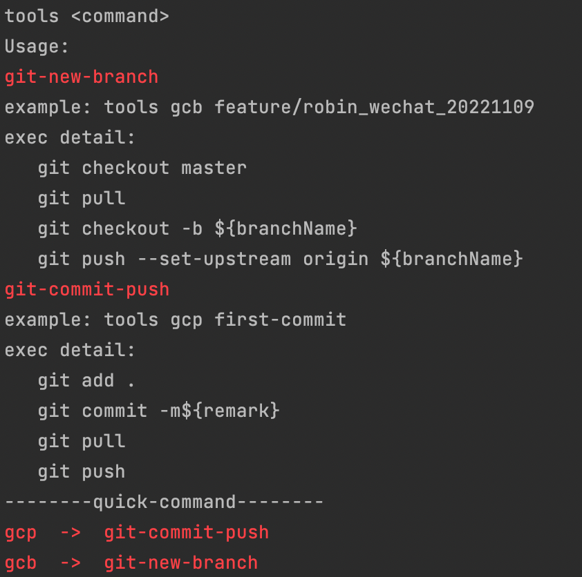

# 终端快捷小工具-提升效率-化繁为简

## 命令行工具-自动执行多个命令

```
tools gcp first-commit-remark

将会自动提交push，执行如下命令:
 * git add .
 * git commit -m"first-commit-remark"
 * git pull
 * git push
 
tools gcb hotfix/robin_updateConfig_20221109

将会自动提交push，执行如下命令:
 * git checkout master
 * git pull
 * git checkout -b "hotfix/robin_updateConfig_20221109"
 * git push --set-upstream origin "hotfix/robin_updateConfig_20221109"
 
可在config/commands.yaml自行配置：
配置如下：
short-key:
  gcp: "git-commit-push"
  gcb: "git-new-branch"
cmds:
  git-commit-push:
    - "git add ."
    - "git commit -m${remark}"
    - "git pull"
    - "git push"
  git-new-branch:
    - "git checkout master"
    - "git pull"
    - "git checkout -b ${branchName}"
    - "git push --set-upstream origin ${branchName}" 
```

